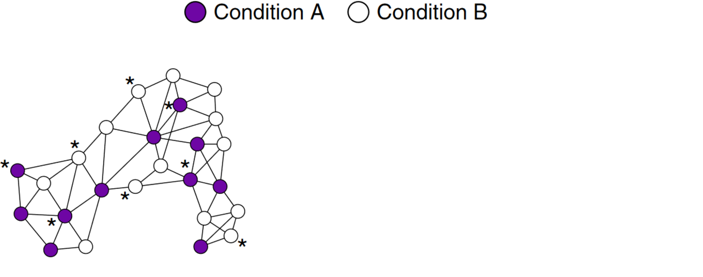
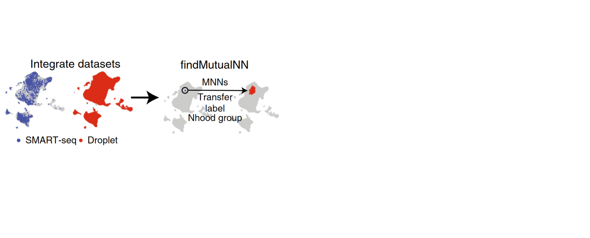

```{r , include = FALSE}
knitr::opts_chunk$set(echo = FALSE)
```

```{r xaringan-themer, include=FALSE, warning=FALSE}
library(xaringanthemer)
style_mono_accent(
  base_color = "#1c5253",
  header_font_google = google_font("Josefin Sans"),
  text_font_google   = google_font("Montserrat", "300", "300i"),
  code_font_google   = google_font("Fira Mono"),
  text_font_size = "1.5rem"
)
```

class: center

# Standard-practice single-cell analysis

<figure>
  <p></p>
  <figcaption>Modified from Arend (2021)<figcaption>
</figure>

???

---
background-image: url(img/markus-spiske-ks_nwPcGdl8-unsplash.jpg)
background-size:cover

class: bottom


.right[Markus Spiske]

---

class: center 

# Analysing cells along a continuum

<div style = "display: flex; align-items: center; height: 500px">
  
</div>

---

class: center 

# Analysing cells along a continuum

<div style = "display: flex; align-items: center; height: 500px">
  
</div>

???

- How might this help?
  - I suppose because we don't rely so much on particular clusters being perfect
  - Also because cells may not belong to discrete clusters, so we can average over what stage exactly they're in
- When they say that they don't allocate cells to distinct clusters, what they mean is that one cell can belong to more than one cluster, but they still ultimately test those clusters for frequencies
  - Interpretation is presumably still done on the basis of the neighbourhoods

---

class: center

# A nearest-neighbour graph

</figure>
<div style = "display: flex; align-items: center; height: 500px; justify-content: center">
  
</div>
<figcaption><span style="font-size:50%">David Eppstein</span></figcaption>
</figure>

???

- A nearest-neighbour graph is simply where you join each point (or observation or element) to the one that is closest to it
- A k-NN graph is one where you join each observation to the `k` observations closest to it

---

class: center

# What is a neighbourhood?

<span style="align: left"> A neighbourhood is all cells that are connected to an index cell <span>

These cells are therefore either nearest neighbours to the index cell, or the index cell is a nearest neighbour to them

--

Statistical testing centres on the neighbourhood


---

class: center

# How are index cells identified?

<div style = "display: flex; align-items: center; height: 500px; justify-content: center">
  
</div>

???

- They randomly select cells (10% of all cells when there are <100k cells; 0.05 for more than)

---

class: center

# How are index cells identified?

<div style = "display: flex; align-items: center; height: 500px; justify-content: center">
  
</div>

???

- They randomly select cells (10% of all cells when there are <100k cells; 0.05 for more than)
- Then they compute the average position for the nearest neighbour
- Then they choose the cells that are closest to these points as the nearest neighbours

---

background-image: url("img/fomo.png")
background-size: cover
class: inverse, center

# Is every cell analysed?

<a href="https://www.flickr.com/photos/91261194@N06/51081095233" style = "position: relative; top: 460px; left: 550px">source</a>


???

- Hard to say


- In the supp, they say that if you suspect differential abundance in disconnected, rare subsets, you should (perhaps greatly, I think) increase the proportion of cells sampled initially

---

# Refinement step dramatically improves coverage

<div style = "display: flex; align-items: center; height: 475px; justify-content: center">
  
</div>

???

- Based on 5000 cells
- Often converge to same index cell

---

# Refinement step dramatically improves coverage

<div style = "display: flex; align-items: center; height: 475px; justify-content: center">
  
</div>


---

class: center

# Searching for differences in abundances by neighbourhood

--

<div style = "display: flex; align-items: center; height: 425px; justify-content: center">
  
</div>

???

- First, for each neighourhood for each sample, the number of samples are counted

---

class: center

# Searching for differences in abundances by neighbourhood


<div style = "display: flex; align-items: center; height: 425px; justify-content: center">
  
</div>

???

- First, for each neighourhood for each sample, the number of samples are counted
- These are modelled using a negative binomial model
  - Allows for more complex experimental designs
  - Allows for skewer distributions
  - Allows cell count to vary by sample

---

class: center 

# Searching for differences in abundances by neighbourhood


<div style = "display: flex; align-items: center; height: 425px; justify-content: center">
  
</div>

???

- First, for each neighourhood for each sample, the number of samples are counted
- These are modelled using a negative binomial model
  - Allows for more complex experimental designs
  - Allows for skewer distributions
  - Allows cell count to vary by sample
- We get out p-values, which we correct using a so-called spatial FDR

---

class: center

# Spatial FDR 

<div style = "display: flex; align-items: center; height: 500px; justify-content: center">
  
</div>

???

- Key point here is that they used an FDR that was "more lenient" because cells could belong to more than one neighbourhood, and so be tested twice
- Very similar formula to the regular FDR procedure, except that per-neighbourhood q-values include weights for how "tight" a neighbourhood is
  - Tighter neighbourhoods are more independent and so are penalised more heavily

---

class: center

# Example results

<div style = "display: flex; align-items: center; height: 500px; justify-content: center">
  
</div>

???

- Not exactly clear how you'd interpret that
  - Perhaps look at "most" different neighbourhood?
- They say that this region was not even identified as a distinct cluster by other methods

---

class: center

# Approaches compared


<div style = "display: flex; align-items: center; height: 500px; justify-content: center">
  
</div>

???

- `Cydar`
  - Assign cells to overlapping hyperspheres, and control FDR using spatial FDR
  
- `DA-seq`
  - Identifies cells belong to regions with differential expression, and *then* clusters them
    - For DA-seq, cells were counted as significant when "absolute differential abundance measure values were larger than the maximum differential abundance measure obtained with randomly permuted labels"


- `Louvain`
  - Assign cells to distinct clusters using graph-based clustering, and tests using a NB GLM

- `Meld`
  - Creates a density based ona  KNN graph
  - User selects threshold for determining statistical significance

---

class: center

# Simulation assessment

<div style = "display: flex; align-items: center; height: 500px; justify-content: center">
  
</div>

???

- Here is an example of a UMAP representation of the KNN graph constructed from simulated/real data

---

class: center

# In silico datasets

<div style = "display: flex; align-items: center; height: 500px; justify-content: center">
  
</div>

???

- To generate entirely-simulated data, they used the `dyntoy` R package, which can simulate single-cell data that has specific "shapes"
- Here they simulate data from discrete clusters

---

class: center

# In silico datasets

<div style = "display: flex; align-items: center; height: 500px; justify-content: center">
  
</div>

???

- To generate entirely-simulated data, they used the `dyntoy` R package, which can simulate single-cell data that has specific "shapes"
- Here they simulate data from discrete clusters
- In B they have a continuous topology

---

class: center

# In silico datasets

<div style = "display: flex; align-items: center; height: 500px; justify-content: center">
  
</div>

???

- To generate entirely-simulated data, they used the `dyntoy` R package, which can simulate single-cell data that has specific "shapes"
- Here they simulate data from discrete clusters
- In B they have a continuous topology
- In C they have a branching topology

---

# Real-world dataset

- Based on the mouse gastrulation atlas
  - Raw count matrix
  - Batch-corrected PCA matrix
  - Chose cells from embryos at specific developmental stages only
  - 64018 cells 

---

class: center

# Assigning per-cell enrichment probability

<div style = "display: flex; align-items: center; height: 500px; justify-content: center">
  
</div>

???

- For each scenario, they give each cell a probability to belonging to one of two conditions
  - For the in-silico dataset without a continuous trajectory, one cluster was enriched for condition C1 and the others were given probability 0.5
  - For the in-silico datasets with continuous trajectory, one cluster was selected as enriched with the mean cell given "maximum enrichment" and enrichment decreasing outwards from there towards 0.5
  - Not entirely sure what they did with the real world data

---

class: center

# Generate per-cell condition labels

<div style = "display: flex; align-items: center; height: 500px; justify-content: center">
  
</div>

???

- For each simulation for each dataset, they simulate per-cell condition labels based on the previously-defined probabilities

---

class: center

# Identify differentially-abundant cells

<div style = "display: flex; align-items: center; height: 500px; justify-content: center">
  
</div>

???

- Do this for each method

---

class: center

# Determine ground truth

<div style = "display: flex; align-items: center; height: 500px; justify-content: center">
  
</div>

???

- As far as I can tell, this is done on a per-cell basis
  - This results in continuous regions in the plot because the probability assignments were done in a continuous manner

---

class: center

# Compare predicted to actual

<div style = "display: flex; align-items: center; height: 500px; justify-content: center">
  
</div>

???

- Here they then calculate the TPR (sensitivity) and FDR
  - Two well-chosen measures, as the true-positives are rarer (so getting high TPR with low FDR is hard)

---

class: center

# Simulation results

<div style = "display: flex; align-items: center; height: 500px; justify-content: center">
  
</div>

???

- I don't undersatnd why FDR got worse for Cydar and TPR got worse for Louvain as effect size went up
- These are faily big effect sizes
- Milo is controlling the FDR well below the nominal rate of 0.1
  - Indicates problem with spatial FDR control calibration?
- Cydar was very insensitive, as was DAse
- Unclear why Louvain + NB was so quick to declare differences
- Overall, though, based on their simulation setup, their algorithm did the best

---

# Simulated batch effects

- Confounded condition with batch
  - Allocated cells randomly to one of two batches
  - Added a certain probability of belonging to cluster C1 for all the cells in one of the batches

---

class: center

# Simulation results under batch effects

<div style = "display: flex; align-items: center; height: 500px; justify-content: center">
  
</div>

???

- Cydar's sensitivity drops off dramatically
- DE-seq gets lots of false positives
- Louvain and Milo used fixed/random effects for batch, and so were fine
- Milo's performance less affected by batch effects than other methods

---

class: center

# Milo is scalable (by scRNAseq standards)

<div style = "display: flex; align-items: center; height: 500px; justify-content: center">
  
</div>

???

---

class: center

# Milo is scalable (by scRNAseq standards)

<div style = "display: flex; align-items: center; height: 500px; justify-content: center">
  
</div>

???

---

class: center

# Application: scRNA-seq mouse dataset

<div style = "display: flex; align-items: center; height: 500px; justify-content: center">
  
</div>

???

- Cell types
  - Thymic epitehlial cells (TECs)
  - 2327 cells
  - Previously clustered into nine subtypes

---

class: center

# Application: scRNA-seq mouse dataset

<div style = "display: flex; align-items: center; height: 500px; justify-content: center">
  
</div>

???

- Cell types
  - Thymic epitehlial cells (TECs)
  - 2327 cells
  - Previously clustered into nine subtypes

- Sampling
  - Across first year of mouse life
    - Weeks: 1, 4, 16, 32 and 52

- Study goal
  - Identify TEC subtypes that changed in frequency during aging
 
---

class: center

# Differentially-abundant neighbourhoods

<div style = "display: flex; align-items: center; height: 500px; justify-content: center">
  
</div>

???

- These were the differentially-abundant neighbourhoods identified

---

class: center

# Comparison with original study's results

<div style = "display: flex; align-items: center; height: 500px; justify-content: center">
  
</div>

???

- Showed some variation within these datasets - some went down and some went up

---

class: center

# Further interrogation of intertypical TECs

<div style = "display: flex; align-items: center; height: 500px; justify-content: center">
  
</div>

???

- First grouped the differential abundance neighborhoods with overlapping cells and concordant differential abundance fold change

---

class: center

# Further interrogation of intertypical TECs

<div style = "display: flex; align-items: center; height: 500px; justify-content: center">
  
</div>

???

- First grouped the differential abundance neighborhoods with overlapping cells and concordant differential abundance fold change
- Looked for differentially-expressed genes

---

class: center

# Integration with larger droplet scRNA-seq data

<div style = "display: flex; align-items: center; height: 450px; justify-content: center">
  
</div>

???

- Integrated data using mutual nearest-neighbours algorithm

---

class: center

# Integration with larger droplet scRNA-seq data

<div style = "display: flex; align-items: center; height: 450px; justify-content: center">
  
</div>

???

- Transferred neighbourhood group labels from SMART_seq to droplet scRNAseq
- Examined the drop scRNAseq data, finding that the transcriptionally-similar cells were indeed depleted in older mice

---

class: center

# Analysis of human liver cells: healthy vs cirrhotic

<div style = "display: flex; align-items: center; height: 450px; justify-content: center">
  
</div>

???

- Human liver cells from 5 healthy and five with cirrhosis

---

class: center

# Analysis of human liver cells: healthy vs cirrhotic

<div style = "display: flex; align-items: center; height: 450px; justify-content: center">
  
</div>

???

- Interestingly still found differently-behaving subsets within the major subsets

